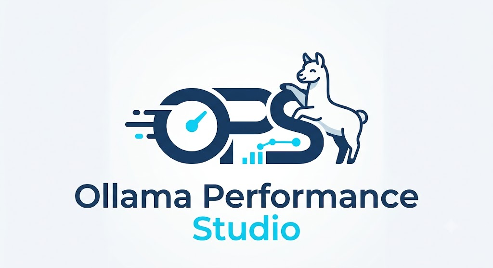

<div align="center">
  
  <p>Python CLI tool to benchmark and compare local LLM models served via <a href="https://ollama.com">Ollama</a>.</p>
</div>

---

If you run local LLMs and want to know which model performs best on **your specific hardware** — whether a personal PC or a server — this tool gives you a data-driven answer. It pulls each model, runs a configurable set of prompts, measures performance and resource usage, and ranks them so you can make an informed choice without guesswork.

## Features

- **Performance metrics** — TTFT, tokens/s, inter-token latency, cold start, download time
- **Resource monitoring** — CPU, RAM, GPU, VRAM, temperature, power (real-time)
- **Quality scoring** — cosine similarity against expected answers, or an LLM judge model
- **HTML report** — self-contained, interactive, with charts and rankings
- **Web dashboard** — explore historical sessions via a local Flask app
- **SQLite persistence** — all results stored locally for session comparison

## Requirements

- Python 3.10+
- [Ollama](https://ollama.com) installed and running
- (Optional) NVIDIA GPU + `pynvml` for GPU metrics

## Installation

```bash
git clone https://github.com/AcerosDavid/ollama-performance-studio.git
cd ollama-performance-studio
pip install -e ".[dev]"
```

## Quick Start

```bash
# 1. Edit config.yaml with your models and prompts

# 2. Run the benchmark
ops run --config config.yaml --output ./results

# Verbose mode (shows commands, prompts, responses, resource metrics)
ops run --config config.yaml --output ./results --verbose
```

The report is saved to `results/report_<session_id>.html`.

The SQLite database (`benchmark.db`) is created automatically on the first run. No setup required.

## Screenshots

<div align="center">
  
  <br/><em>Overall Rankings and Performance Metrics</em>
</div>

<br/>

<div align="center">
  
  <br/><em>Resource Consumption Over Time</em>
</div>

## CLI Reference

| Command | Description |
|---------|-------------|
| `ops run [--config] [--output] [--verbose]` | Run a benchmark session |
| `ops report [--session] [--output]` | Regenerate a report from existing data |
| `ops dashboard [--port] [--db]` | Launch the web dashboard (default: `localhost:8080`) |
| `ops list [--db]` | List all stored sessions |
| `ops compare <id> <id> ...` | Compare sessions side by side |

## Configuration

Copy `config.yaml` and edit it. Required fields:

```yaml
models:
  - qwen:0.5b-chat-v1.5-q3_K_M

prompts:
  reasoning:
    - text: "A bat and a ball cost $1.10. The bat costs $1.00 more. How much is the ball?"
      expected_answer: "The ball costs $0.05."   # optional — enables similarity scoring

timeouts:
  download: 3600
  cold_start: 120
  inference: 20
  judge: 30
```

Optional fields: `judge_model`, `resource_thresholds`, `database_path`, `plugins_dir`, `max_retries`, `ollama_base_url`.

See `config.yaml` for the full reference with comments.

## Metrics Collected

| Metric | Unit |
|--------|------|
| Time to first token (TTFT) | ms |
| Tokens per second | tps |
| Avg inter-token latency | ms |
| CPU / RAM / GPU / VRAM usage | % / MB |
| CPU / GPU temperature | °C |
| Power consumption | W |
| Quality score (similarity or judge) | 0–1 |
| Stability score | 0–1 |

## Development

```bash
pip install -e ".[dev]"

pytest                              # all tests
pytest -k "not integration"         # unit tests only (no live Ollama needed)
pytest -k "property" --hypothesis-seed=0
```

## License

MIT
